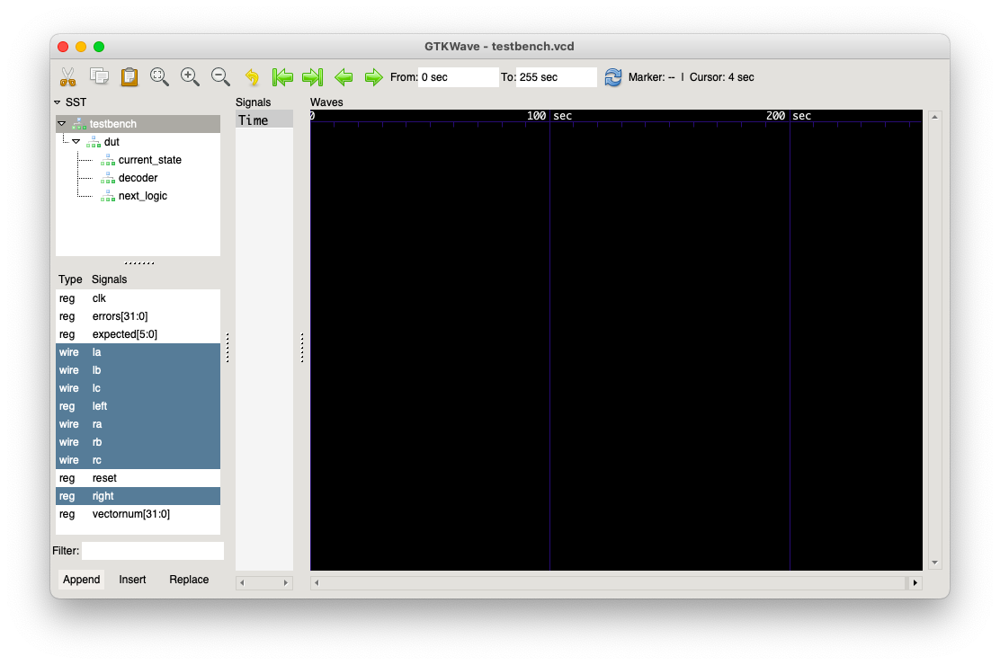
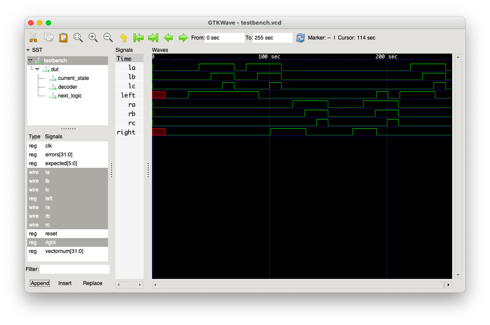

## Разработка на SystemVerilog из операционной системы MacOS

Для выполнения лабораторной работы под операционной системой MacOS можно использовать Icarus Verilog для компиляции и GTKWave для построения Wave-форм.

### Установка

#### Icarus Verilog

Icarus Verilog можно установить с помощью brew (https://brew.sh/)    
```brew install icarus-verilog```

#### GTKWave

Для начала установите GTKWave с помощью brew  

```brew install gtkwave```  

Скорее всего, сразу после установки при попытке запуска GTKWave Вы увидите ошибку из-за того, что не установлен необходимый модуль Switch языка Perl.  

##### Установка Perl Switch

Установите Switch с помощью пакетного менеджера языка:
```
cpan install Switch
perl -V:'installsitelib'
```

Последняя команда выведет в консоль путь, по которому Switch был установлен. Если он выглядит примерно как ```/usr/local/Cellar/perl/...```, то Switch необходимо переместить в нужную директорию: 

```sudo cp /usr/local/Cellar/perl/5.*/lib/perl5/site_perl/5.*/Switch.pm /Library/Perl/5.*/```, где вместо ```*``` нужно указать Вашу версию Perl.

Пример:  
Вывод команды ```perl -V:'installsitelib'```:  
```installsitelib='/usr/local/Cellar/perl/5.34.0/lib/perl5/site_perl/5.34.0';```  
Команда, чтобы переместить Switch в нужную директорию:  

```sudo cp /usr/local/Cellar/perl/5.34.0/lib/perl5/site_perl/5.34.0/Switch.pm /Library/Perl/5.34.0/```

Теперь можно запустить GTKWave:
```/Applications/gtkwave.app/Contents/Resources/bin/gtkwave```

##### Как запускать проще
Чтобы не вводить полный путь к GTKWave каждый раз при запуске, есть 2 варианта:
1. Создать alias. Для этого добавьте следующую строчку в Ваш ```~/.bash_profile```:  
```alias gktwave = /Applications/gtkwave.app/Contents/Resources/bin/gtkwave```  

2. Добавить путь к GTKWave в PATH. Для этого добавьте следующее в Ваш ```~/.bash_profile```:  
```export PATH= /Applications/gtkwave.app/Contents/Resources/bin/:$PATH```  
Теперь после перезагрузки терминала можно будет запускать GTKWave с помощью соответствующей команды ```gtkwave```


### Запуск

#### Icarus Verilog

Чтобы собрать исполняемый файл, используйте команду  
```iverilog -g2012 -o <executable_name> <source_files>``` 

Пример:  
```iverilog -g2012 -o main main.sv```  
Флаг ```-g2012``` добавляется для поддержки более свежего стандарта Verilog, где присутствуют некоторые "фичи" SystemVerilog (полной поддержки SystemVerilog Icarus Verilog не имеет).

Чтобы запустить исполняемый файл используйте команду  
```vvp <executable_name>```  
Пример:  
```vvp main```

#### GTKWave

Чтобы сгенерировать Wave-формы, необходимо:
1. В initial-блоке своего testbench добавьте генерацию vcd-файла:  
```
initial
  begin
    $dumpfile("dump.vcd");
    $dumpvars(0, <module_name>);
  end
```  
Здесь ```<module_name>``` - имя модуля, к которому нужно строить Wave-форму (в лабораторной работе скорее всего это будет testbench). 

2. После того, как Вы запустите исполняемый файл и dump.vcd будет сгенерирован, запустите GTKWave и откройте там dump.vcd:  
```gtkwave dump.vcd```

3. Добавьте в отслеживание то, что Вам нужно :)
  
  
